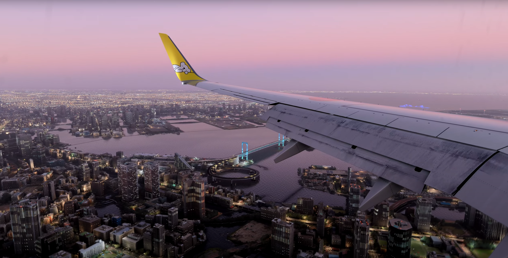

# Microsoft Flight Simulator 2020 Handcrafted Airports

- [Microsoft Flight Simulator 2020 Handcrafted Airports](#microsoft-flight-simulator-2020-handcrafted-airports)
  - [About](#about)
  - [North America](#north-america)
    - [Canada](#canada)
    - [USA](#usa)
  - [Central America](#central-america)
    - [Costa Rica](#costa-rica)
    - [Caribbean](#caribbean)
    - [Honduras](#honduras)
  - [South America](#south-america)
    - [Brasil](#brasil)
    - [Peru](#peru)
  - [Indonesia](#indonesia)
  - [Asia-Pacific](#asia-pacific)
    - [Australia](#australia)
    - [China](#china)
    - [New Zealand](#new-zealand)
    - [Oceania](#oceania)
    - [Japan](#japan)
  - [Africa](#africa)
  - [Europe](#europe)
  - [Eastern Europe](#eastern-europe)
    - [France](#france)
    - [Germany, Austria, Switzerland](#germany-austria-switzerland)
    - [Iberia](#iberia)
    - [Italy, Malta](#italy-malta)
    - [Nordics, Greenland](#nordics-greenland)
    - [UK, Ireland, Scotland, Wales](#uk-ireland-scotland-wales)

## About

List of all handcrafted airports from Standard Edition and World Updates (apart from Deluxe/Premium Edition ones).

## North America

### Canada

    Bella Coola Airport (ICAO: CYBD)
    Castlegar Airport (ICAO: CYCG)
    Dawson City Airport (ICAO: CYDA)
    Deer Lake Airport (ICAO: CYDF)
    Iqaluit International Airport (ICAO: CYFB)
    Billy Bishop Toronto City Airport (ICAO: CYTZ)

### USA

    Aspen-Pitkin County Airport (ICAO: KASE)
    Friday Harbor Airport (ICAO: KFHR)
    Dallas-Fort Worth International Airport (ICAO: KDFW)
    Stewart International Airport (ICAO: KSWF)
    Hartsfield-Jackson Atlanta International Airport (ICAO: KATL)
    Catalina Airport (ICAO: KAVX)
    Valdez Airport (ICAO: PAVD)
    Lake Tahoe Airport (ICAO: KTVL)
    Block Island Airport (ICAO: KBID)
    Los Angeles International Airport (ICAO: KLAX)
    Nanwalek Airport (IATA: KEB)
    John F. Kennedy International Airport (ICAO: KJFK)
    Orlando International Airport (ICAO: KMCO)
    Mariscal Sucre International Airport (ICAO: SEQM)
    Sedona Airport (ICAO: KSEZ)
    Seattle-Tacoma International Airport (ICAO: KSEA)
    Stewart Aerodrome (ICAO: CZST)
    Telluride Regional Airport (ICAO: KTEX)

## Central America

### Costa Rica

    Sirena Aerodrome (ICAO: MRSN)

### Caribbean

    Gregorio Luperón International Airport (Puerto Plata Airport) (ICAO: MDPP)
    Antoine-Simon Airport (ICAO: MTCA)
    Sangster International Airport (ICAO: MKJS)
    A.N.R. Robinson International Airport (formerly Crown Point International Airport) (ICAO: TTCP)
    North Eleuthera Airport (ICAO: MYEH)
    Les Saintes Airport (ICAO: TFFS)
    Vilo Acuña International Airport (ICAO: MUCL)
    Princess Juliana International Airport (ICAO: TNCM)
    Juancho E. Yrauquin Airport (ICAO: TNCS)
    Gustaf III Airport (ICAO: TFFJ)

### Honduras

    Toncontin International Airport (ICAO: MHTG)

## South America

### Brasil

    Rio de Janeiro/Galeão International Airport (ICAO: SBGL)

### Peru

    Chagual Airport (ICAO: SPGL)

## Indonesia

    Paro International Airport (ICAO: VQPR)
    Bugalaga Airstrip (ICAO: WX53)
    Tenzing-Hillary Airport (ICAO: VNLK)

## Asia-Pacific

### Australia

    Sydney Kingsford Smith Airport (ICAO: YSSY)
    Cambridge Bay Airport (ICAO: YMBT)
    Longreach Airport (ICAO: YLRE)
    Paraburdoo Airport (ICAO: YPBO)
    Shellharbour Airport (ICAO: YSHL)

### China

    Kai Tak International Airport (ICAO: VHHX)

### New Zealand

    Gisborne Airport (ICAO: NZGS)
    Milford Sound Airport (ICAO: NZMF)
    Martins Bay Aerodrome (ICAO: NZMJ)
    Gorge River Airstrip (ICAO: NZQE)
    Rotorua Airport (ICAO: NZRO)
    Lake Tekapo Airport (ICAO: NZTL)
    Whangarei Airport (ICAO: NZWR)
    Westport Airport (ICAO: NZWS)
    Quintin Lodge Airstrip (ICAO: T004)
    Queenstown Airport (ICAO: NZQN)

### Oceania

    Mataveri International Airport (ICAO: SCIP)
    Kona International Airport (ICAO: PHKO)
    Nusatupe Airport (ICAO: AGGN)
    Bora Bora Airport (ICAO: NTTB)
    Moorea Airport (ICAO: NTTM)
    Aitutaki Airport (ICAO: NCAI)
    Pohnpei International Airport (ICAO: PTPN)
    Adisumarmo International Airport (ICAO: WAHQ)

### Japan

    Bryant Army Airfield Heliport (IATA: FRNICAO: PAFR)
    Hachijojima Airport (IATA: HACICAO: RJTH)
    Kerama Airport (IATA: KJPICAO: ROKR)
    Kushiro Airport (IATA: KUHICAO: RJCK)
    Nagasaki Airport (IATA: NGSICAO: RJFU)
    Shimojishima Airport (IATA: SHIICAO: RORS)
    Suwanosejima Airport (ICAO: RJX8)
    Haneda Airport (ICAO: RJTT)

## Africa

    Entebbe International Airport (ICAO: HUEN)

## Europe

## Eastern Europe

    Karlovy Vary Airport (ICAO: LKKV)
    Poprad-Tatry Airport (ICAO: LZTT)
    Pécs-Pogány Airport (ICAO: LHPP)
    Zagorje ob Savi Airport (ICAO: LJZA)
    Rijeka International Airport (ICAO: LDRI)
    Prijedor Urije Airport (ICAO: LQPD)

### France

    Charles de Gaulle Airport (ICAO: LFPG)
    Courchevel Altiport (ICAO: LFLJ)
    Megève Altiport (ICAO: LFHM)
    Nice Côte d'Azur Airport (ICAO: LFMN)
    Rotterdam The Hague Airport (ICAO: EHRD)

### Germany, Austria, Switzerland

    Klagenfurt Airport (ICAO: LOWK)
    Lübeck Airport (ICAO: EDHL)
    St. Gallen-Altenrhein Airport (ICAO: LSZR)
    Stuttgart Airport (ICAO: EDDS)
    Leipzig/Halle Airport (ICAO: EDDP)
    Memmingen Airport (ICAO: EDJA)
    Kassel Airport (ICAO: EDVK)
    Zurich Airport (ICAO: LSZH)
    Luzern-Beromunster Airport (ICAO: LSZO)
    Cologne Bonn Airport (ICAO: EDDK)
    Innsbruck Airport (ICAO: LOWI)

### Iberia

    Andorra-La Seu d'Urgell Airport (ICAO: LESU)
    Pico Airport (ICAO: LPPI)
    Faro Airport (ICAO: LPFR)
    A Coruña Airport (ICAO: LECO)
    Cristiano Ronaldo Madeira International Airport (ICAO: LPMA)
    Gibraltar International Airport (ICAO: LXGB)

### Italy, Malta

    Lugano Airport (ICAO: LSZA)
    Falcone Borsellino Airport (ICAO: LICJ)
    Iloilo International Airport (ICAO: LILO)
    Marina di Campo Airport (ICAO: LIRJ)
    Bolzano Airport (ICAO: LIPB)

### Nordics, Greenland

    Bornholm Airport (ICAO: EKRN)
    Ísafjörður Airport (ICAO: BIIS)
    Stockholm Arlanda Airport (ICAO: ESSA)
    Svalbard Airport (ICAO: ENSB)
    Vaasa Airport (ICAO: EFVA)
    Akureyri Airport (ICAO: BIAR)
    Mo i Rana Airport (ICAO: ENRA)
    Kiruna Airport (ICAO: ESNQ)
    Ivalo Airport (ICAO: EFIV)
    Leknes Airport (ICAO: ENLK)

### UK, Ireland, Scotland, Wales

    Barra Airport (ICAO: EGPR)
    Donegal Airport (ICAO: EIDL)
    Liverpool John Lennon Airport (ICAO: EGGP)
    Land's End Airport (ICAO: EGHC)
    Manchester City Airport & Heliport (ICAO: EGCB)
    Out Skerries Airstrip (ICAO: EG78)
    Farnborough Airport (ICAO: EGLF)
    London Stansted Airport (ICAO: EGSS)
    Cork Airport (ICAO: EICK)
    Sumburgh Airport (ICAO: EGPB)
    Cardiff (ICAO: EGFF)
